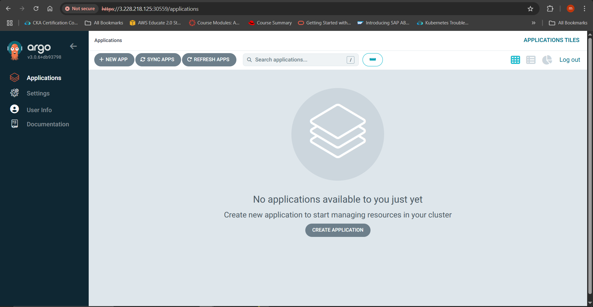
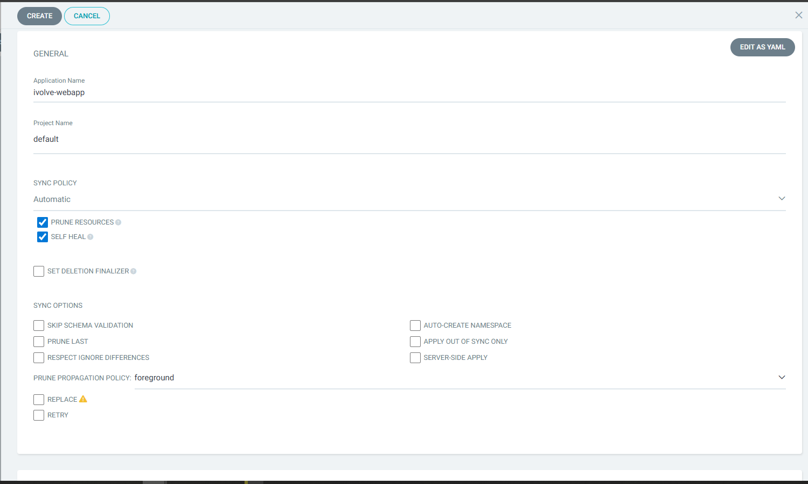
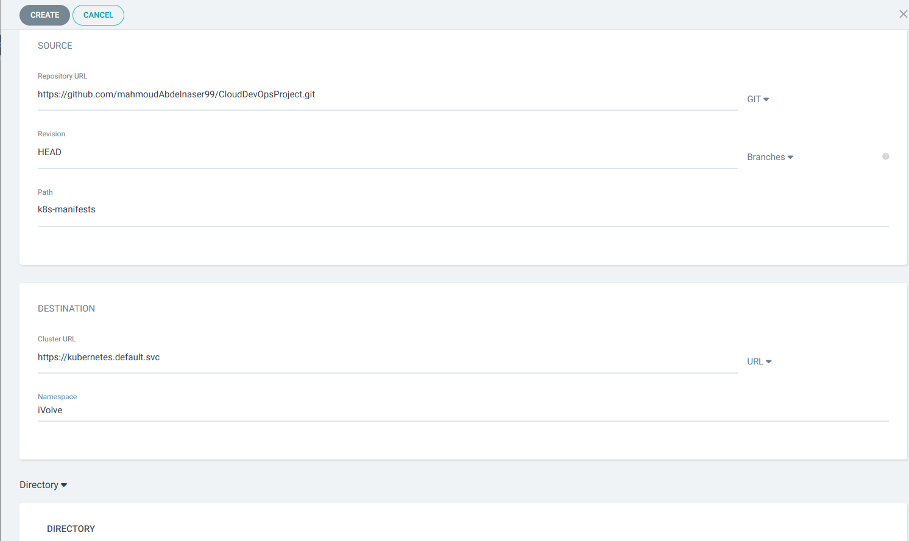
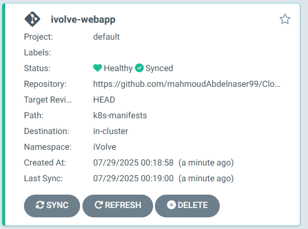
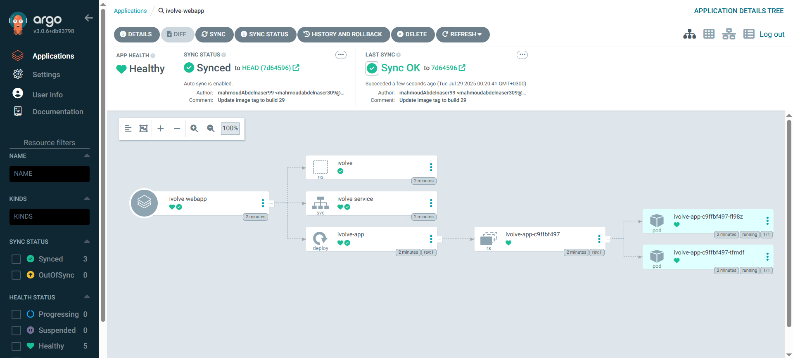
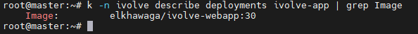
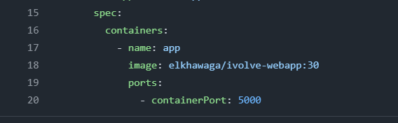
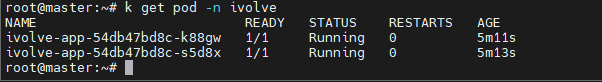
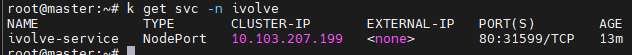
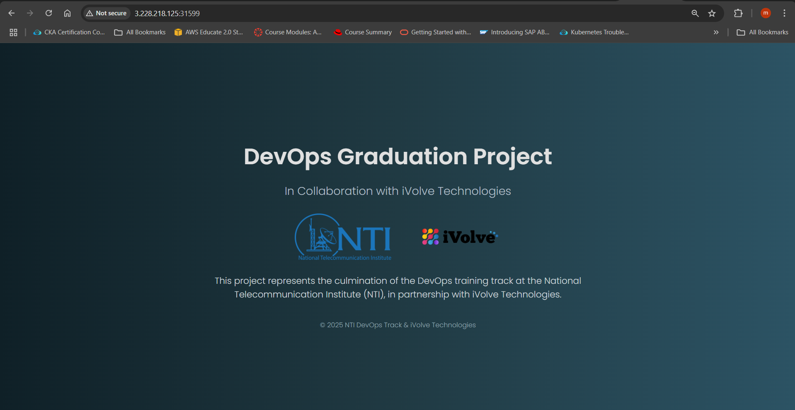

# ArgoCD Deployment Configuration for iVolve Web Application

## Prerequisites
- Kubernetes cluster with ArgoCD installed 
- Access to ArgoCD web UI (typically https://8080)
- Existing Kubernetes manifests repository 
- Cluster admin permissions

## Step 1: Prepare Kubernetes Manifests Repository
1. Create new repository on GitHub:
   - Name: `kubernetes-manifests`
2. Add required manifest files:
   - `deployment.yaml` (with image placeholder)
   - `service.yaml`
   - `ingress.yaml`
   - `namespace.yaml`


## Step 2: Access ArgoCD Web UI
1. Open  web browser and navigate to the ArgoCD URL
2. Log in using credentials (username/password)
   - to get the pass 
 ```bash 
   kubectl -n argocd get secret argocd-initial-admin-secret -o jsonpath="{.data.password}" | base64 -d; echo
   ```
3. Verify you see the default ArgoCD dashboard



## Step 3: Configure Repository in ArgoCD
2. **From settings Add New Repository**:
   - Click **+ Connect Repo** button
   - Choose your connection method: **VIA HTTPS**
   - Click **Connect**

3. **Verify Connection**:
   - Status should show "Successful"
   - Test connection by clicking **Refresh** button


## Step 4: Create New Application
1. Click "+ New App" button in top navigation
2. Configure application settings:

**General Section:**
- Application Name: `ivolve-webapp`  
- Project: `default`  
- Sync Policy:  
  ✓ Automatic sync  
  ✓ Self-Heal  



**Source Section:**
- Repository URL: `https://github.com/mahmoudAbdelnaser99/CloudDevOpsProject/tree/main/k8s-manifests`  
- Revision: `main`  
- Path: `.` (root directory of repo)  

**Destination Section:**
- Cluster: `in-cluster`  
- Namespace: `ivolve-app`  

3. Click "Create" button



## Step 4: Verify Initial Deployment
1. In Applications list:
   - Locate `ivolve-webapp`
   - Verify status changes from "OutOfSync" → "Synced"
   - Health status should show "Healthy"



3. Verify resources:
   - Click application name
   - Check "Resources" tab for:
     - Deployment (1/1 available)
     - Service (ClusterIP created)
     - Pods (Running status)



## Step 6: Test Pipeline-Driven Deployment Flow

### 1. Manually Trigger Pipeline
1. **In Jenkins UI**:
   - Navigate to your `ivolve-webapp-pipeline` job
   - Click **Build Now** 

### 2. Verify Automated Manifest Update
1. **Check Git commit** (within 1 minute of pipeline completion):


### 3. Observe ArgoCD Response (Within 3 Minutes)
1. **In ArgoCD UI**:
   - Application status will transition:
     ```
     Synced → OutOfSync → Syncing → Synced
     ```
   - Health status may briefly show **Progressing** during rollout


2. **Verify deployment update**:
   ```bash
   kubectl -n ivolve-app describe deployment ivolve-webapp | grep Image
   ```
   Output should match the new BUILD_NUMBER from Jenkins




### 4. Validate Pod Rotation
1. **Check pod versions**:
   ```bash
   kubectl -n ivolve-app get pods 
   ```
   - Old pods will be terminating (if using rolling updates)
   - New pods will show the updated image tag



   - access the application 
with ip of node + svc port





