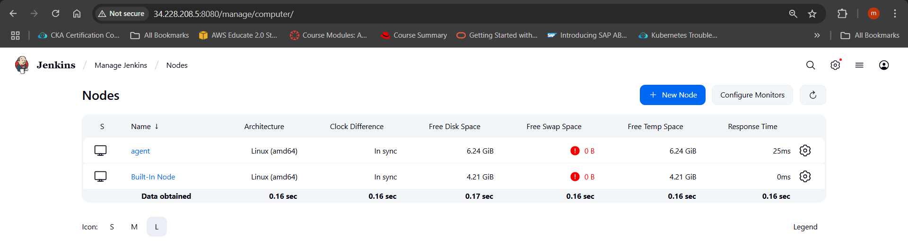
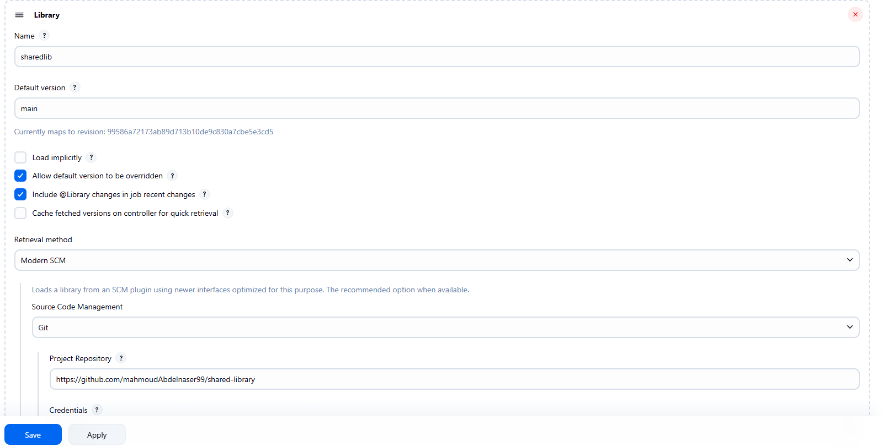
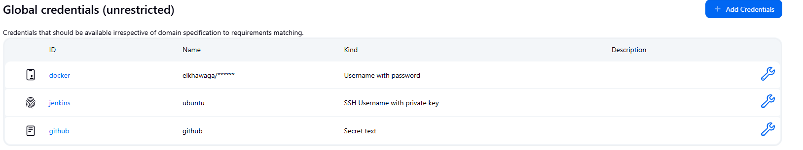
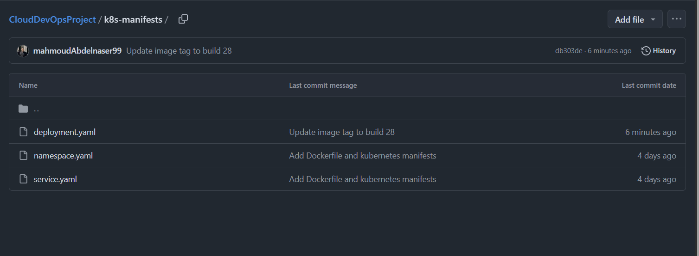
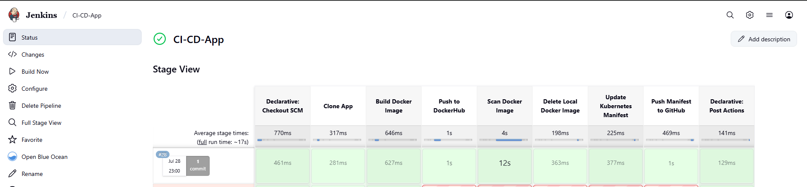

Here's a comprehensive README file with detailed steps for setting up the Jenkins CI/CD pipeline for the iVolve web application:

---

# Jenkins CI/CD Pipeline Setup for iVolve Web Application

## Table of Contents
1. Prerequisites
2. Jenkins Slave Configuration
3. Shared Library Setup
5. Credentials Configuration
6. Pipeline Job Creation
7. Kubernetes Manifests Preparation
8. Running the Pipeline
9. Verification Steps

## 1. Prerequisites

- Jenkins master and slave instances provisioned using **Ansible playbooks**
- Java Development Kit (JDK) installed on both Jenkins **master and slave**
- Git installed and configured on both instances
- Docker installed and configured on the Jenkins slave
- Kubernetes cluster accessible from the Jenkins slave
- GitHub repository for the iVolve web application
- Separate GitHub repository for **Kubernetes manifests**

## 2. Jenkins Slave Configuration

Follow these steps to configure the Jenkins slave:

1. Log in to the Jenkins master web interface
2. Navigate to Manage Jenkins > Manage Nodes and Clouds
3. Click New Node to create a new agent
4. Enter "agent" as the node name and select Permanent Agent
5. Configure the node with these settings:
   - Remote root directory: /home/ubuntu
   - Labels: slave
   - Usage: Use this node as much as possible
   - Launch method: Launch agent via SSH
6. Enter the **Private IP address** of Jenkins slave instance
7. Add SSH credentials for the ubuntu user with the private key
```bash
    cat jenkins-key.pem
```
8. Set Host Key Verification Strategy to Non verifying Verification Strategy
9. Click Save to create the node
10. Verify the slave connection appears online in the Nodes list



## 3. Shared Library Setup

To create and configure the Jenkins shared library:

1. Create a new Git repository named "jenkins-shared-library"
2. Clone the repository to  local machine
3. Create the following directory structure in the repository:
   - vars/ for global pipeline variables
4. Add the Groovy scripts for Docker operations and Git operations
5. Commit and push the initial implementation to the repository
6. In Jenkins, navigate to Manage Jenkins > Configure System
7. Scroll to trusted Global Pipeline Libraries section
8. Add a new library with name "jenkins-shared-library"
9. Configure the library with:
   - Default version: main
   - Retrieval method: Modern SCM
   - Source Code Management: Git
   - Repository URL of your shared library
   - Credentials if required
10. Click Save to apply the configuration




## 5. Credentials Configuration

Set up the required credentials in Jenkins:

1. Docker Hub credentials:
   - Navigate to Manage Jenkins > Manage Credentials
   - Add new credentials with type Username with password
   - Enter your Docker Hub username and password
   - Set ID to "docker"

2. Git SSH credentials:
   - In the same credentials section
   - Add new credentials with type SSH Username with private key
   - Enter "git" as username
   - Paste your SSH private key
   - Set ID to "git-credentials"
   - Add description "Git SSH Credentials"



## 6. Pipeline Job Creation

Create and configure the main pipeline job:

1. From Jenkins dashboard, click New Item
2. Enter "iVolve-WebApp" as name
3. Select Pipeline type and click OK
4. In the configuration page:
   - Under Pipeline section, select Pipeline script from SCM
   - Choose Git as SCM
   - Enter application repository URL
   - Add Git credentials 
   - Specify branch (main)
   - Set Script Path to **jenkins/jenkinsfile**
5. Click Save to create the pipeline

## 7. Kubernetes Manifests Preparation

Prepare your Kubernetes manifests repository:

1. Create a new Git repository for Kubernetes manifests
2. Add your existing Kubernetes YAML files:
   - deployment.yaml
   - service.yaml
   - ingress.yaml
   - persistent volume files
3. Organize the repository with clear structure
4. Modify deployment.yaml to use image placeholder:
   - Set image field to use  Docker image name with :latest tag
   - This will be updated by the pipeline




## 9. Verification Steps

After pipeline completion, verify all components:

1. Docker Image:
   - Log in to Docker Hub
   - Verify new image with build number tag exists


2. Kubernetes Manifests:
   - Check the Git repository commit history
   - Verify deployment.yaml was updated with new image tag


3. Application:
   - Check Kubernetes cluster for new deployment
   - Verify application pods are running with new image
   - Test application functionality

4. Review pipeline




