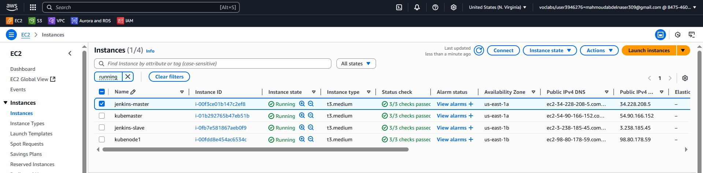
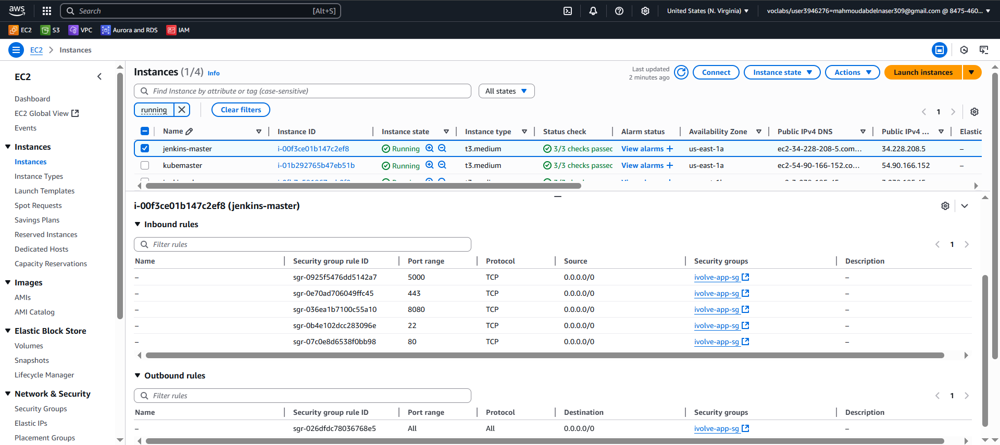
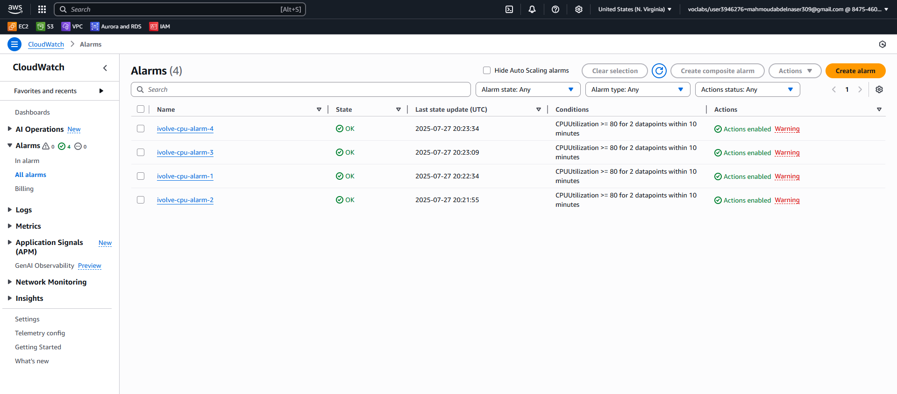
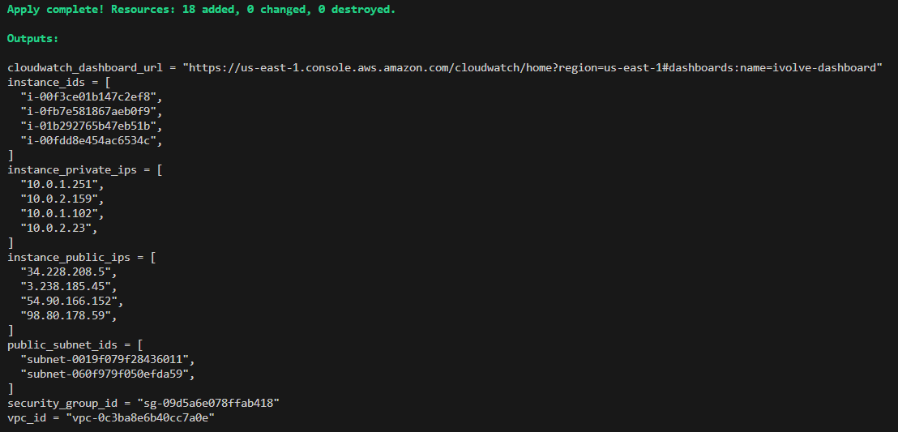
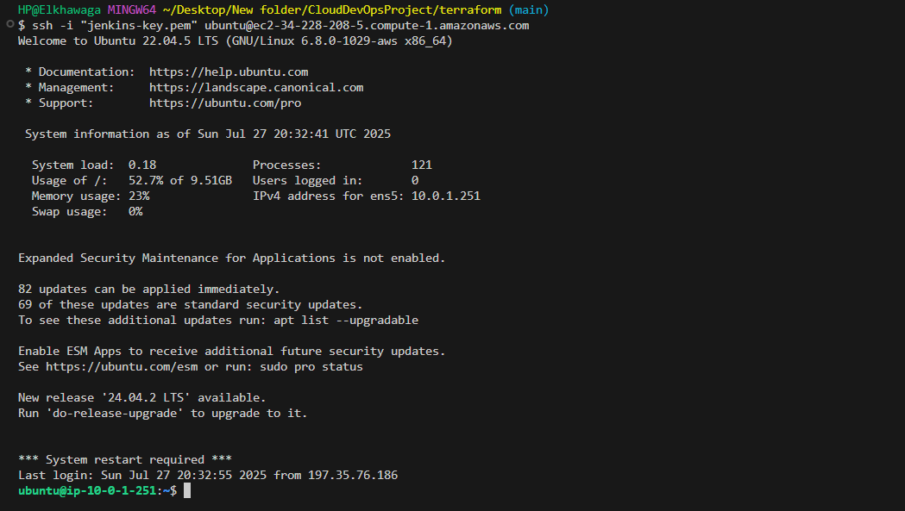

# Jenkins Infrastructure Deployment

## Overview
This document details the exact steps taken to deploy a Jenkins infrastructure on AWS using Terraform. The setup involves provisioning a VPC, configuring subnets, launching EC2 instances for Jenkins Master and Slave, setting up security groups, integrating CloudWatch monitoring, and configuring the Jenkins Master-Slave setup using Terraform modules.

## What I Created
## S3 Backend Configuration
- Configured to store Terraform state in an S3 bucket
- Includes DynamoDB table for state locking to prevent concurrent modifications

## Networking Module
- Creates a VPC with specified CIDR block
- Sets up public subnets across multiple availability zones
- Configures Internet Gateway and routing for public internet access

## Compute Module
- Provisions two EC2 instances across different availability zones
- Creates a security group allowing SSH and application traffic
- Uses Amazon Linux 2 AMI
- Configures EBS volumes for each instance

## CloudWatch Integration
- Sets up CloudWatch dashboard to monitor EC2 instances
- Creates CloudWatch alarms for high CPU utilization
- Configures SNS topic for alarm notifications


## Project Structure
```
jenkins-infrastructure/
├── main.tf
├── variables.tf
├── outputs.tf
├── modules/
│   ├── network/
│   │   ├── main.tf
│   │   ├── variables.tf
│   │   └── outputs.tf
│   └── compute/
│       ├── main.tf
│       ├── variables.tf
│       └── outputs.tf
└── backend.tf
```

## Steps I Took

### 1. Created Terraform Modules
- **Network Module:** Provisions the VPC, subnet, and security group.
- **Servers Module:** Launches Jenkins Master and Slave instances.

### 2. Configured Terraform Backend (S3)
To store Terraform state remotely and enable team collaboration:
```bash
aws s3api create-bucket --bucket jenkins123-terraform-state --region us-east-1
aws s3api put-bucket-versioning --bucket jenkins12345-terraform-state --versioning-configuration Status=Enabled
```

### 3. Created an EC2 Key Pair
To securely access Jenkins instances:
```bash
aws ec2 create-key-pair --key-name jenkins-key --query 'KeyMaterial' --output text > jenkins-key.pem
chmod 400 jenkins-key.pem
```

### 4. Deployed Infrastructure Using Terraform
```bash
terraform init
terraform plan
terraform apply -auto-approve
```

### 5. Verified AWS Resources
Checked the AWS Console to confirm:
- VPC and subnet were created.


- EC2 instances were running.



- Security groups were correctly applied.



- CloudWatch alarms were set up.



### 6. Tested SSH Access to Instances
Retrieved public IPs:
```bash
terraform output
```


Connected to instances:
```bash
ssh -i jenkins-key.pem ec2-user@<jenkins_master_public_ip>
ssh -i jenkins-key.pem ec2-user@<jenkins_slave_public_ip>
```



